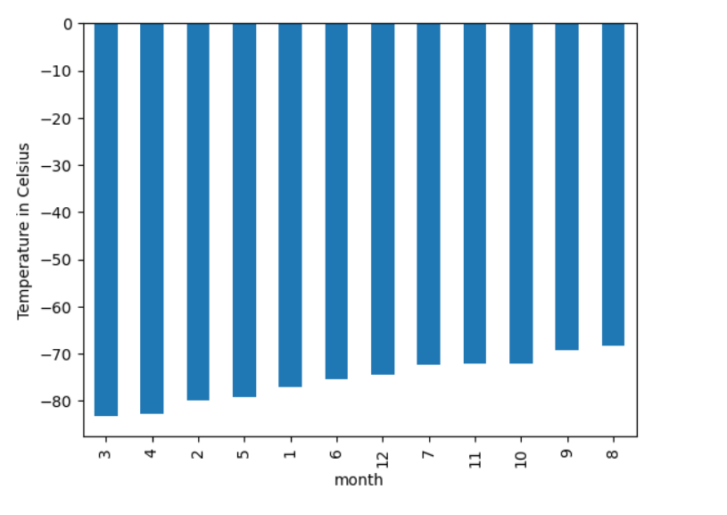
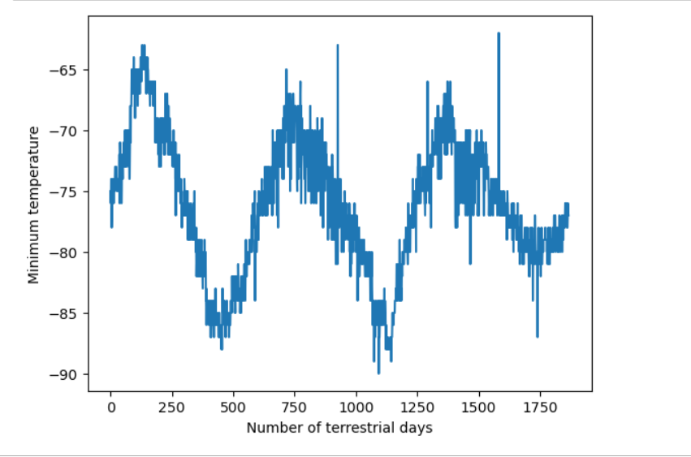

# web_scraping_challenge

This assignment consists of two technical products. In the first part <a href="https://static.bc-edx.com/data/web/mars_news/index.html"> Mars News Website </a> is scraped to get titles and preview text from Mars news articles.
In the second part, Mars weather data, which exists in a table, is scraped and analysed.

###  Part 1: Scrape Titles and Preview Text from Mars News

* Automated browsing (with Splinter) was used to visit the Mars news site, and the HTML code was extracted (with Beautiful Soup).

* The titles and preview text of the news articles were scraped and extracted. 

* The scraped information was stored in the specified Python data structure—specifically, a list of dictionaries.

* A plot is created based on that DataFrame by using the DataFrame plot method, as the following image shows:

 

### Part 2: Scrape and Analyze Mars Weather Data

* The HTML table was extracted into a Pandas DataFrame. Either Pandas or Splinter and Beautiful Soup were used to scrape the data from the table in <a href="https://static.bc-edx.com/data/web/mars_facts/temperature.html"> Mars Temperature Data Site </a>

* The data was analyzed to answer the following questions, and a data visualization was created to support each answer:

    * How many months exist on Mars?
    * How many Martian days' worth of data are there?
    * What are the coldest and the warmest months on Mars? To answer this question:
        * The average minimum daily temperature for all of the months was found.
        * A bar chart was created.

      

  
    

    * Which month, on average, has the lowest atmospheric pressure? The highest?

    * How many terrestrial days exist in a Martian year? A visual estimate within 25% was made.

      

    

* The DataFrame was exported into a CSV file.

  

## Setup   
 'mars_data_analysis' folder is consists of 'part_1_mars_news.ipynb' and   'part_2_mars_weather.ipynb' Jupiter notebooks which are the executables of this assignment, 'Output' folder which contains the scv file generated by 'part_2_mars_weather.ipynb' file, and 'Resources' folder which contains two  'days_num_martian_year.png' and 'hottest_coldest_months.png' resource files for README. Those two files contain plots which are generated by part_2_mars_weather.ipynb' file.

  

## References
This project is a part of UC Berkeley "Data Analysis and Visualisation" Boot Camp education services.

In projects' descriptions, some paragraphs are copy/pasted from 'Module 11 Challenge' of UC Berkeley Data Analytics and Visualisation Bootcamp course.
 
May-17-2023
